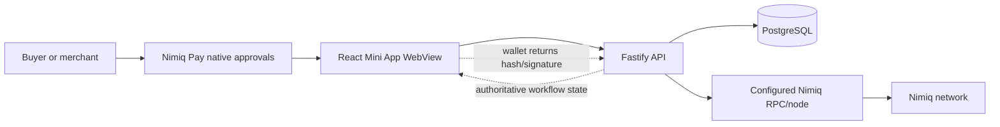
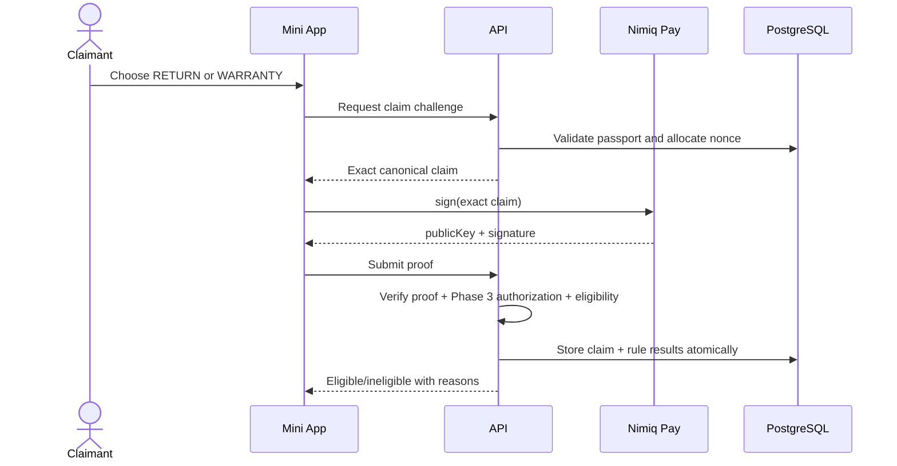
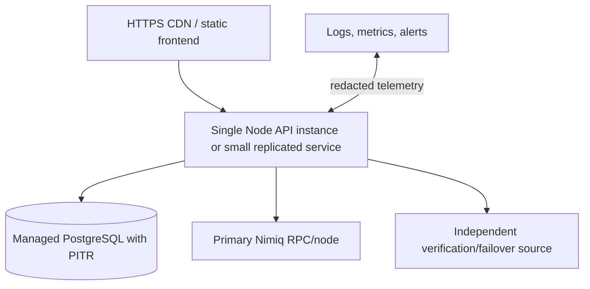

# Architecture

## Status and principles

This document describes the intended MVP architecture. Phase 0 implements the wallet/cryptographic/transaction diagnostic slice. Phase 1 implements the PostgreSQL/domain trust core, configured production policy writers, merchant studio, and fail-closed public proof/history projection. Phase 2 implements immutable purchase orders, direct wallet payment, independent chain verification, Purchase Passports, and append-only reconciliation under D-023 while all unconfirmed device scenarios remain explicitly open for a later consolidated physical session.

The system is deliberately one mobile web frontend, one TypeScript API, one PostgreSQL database, and one Nimiq chain-read boundary. No microservices, application treasury, server wallet, smart contract, queue, or cache is required for MVP.

Principles:

- fail closed on unverifiable money or signatures;
- store evidence, not secret authority;
- make critical transitions idempotent and database-enforced;
- keep pure protocol validation separate from transport and UI;
- show uncertainty honestly;
- prove Nimiq Pay interoperability on a device before formal phase exit; D-023 permits only the documented Phase 2 implementation deferral.

## Selected stack

- **Frontend:** React 19, TypeScript, Vite, plain CSS with component-local organization.
- **Wallet:** `@nimiq/mini-app-sdk` 0.1.0, pinned by `package-lock.json`.
- **Cryptography:** `@nimiq/core` 2.21.0 official `PublicKey`, `Signature`, `Address`, and `Hash` primitives.
- **API:** Node.js 24, Fastify 5, Zod boundary schemas.
- **Data:** PostgreSQL with Drizzle ORM and SQL migrations.
- **Tests:** Vitest for pure/unit/integration tests; browser/device E2E added when flows exist.

Why: Vite/React gives a small, fast mobile SPA and familiar test surface. Fastify supplies a compact typed server with explicit lifecycle behavior. PostgreSQL provides transactions, partial unique indexes, constraints, and row locking required for replay/race resistance. Drizzle keeps SQL visible. A single repository/package reduces deployment and coordination cost.

## System overview



The wallet signs and broadcasts but does not decide NimReturn state. The API verifies and persists but cannot sign or move funds. The database cannot turn an unverified transaction into blockchain truth; reconciliation must re-read evidence when needed.

## Frontend

The SPA is organized by user-visible capability, not framework ceremony:

- `src/app`: application shell and routing/state orchestration;
- `src/features/diagnostics`: Phase 0 internal diagnostic UI;
- `src/features/merchant`: Phase 1 draft, terms, canonical review, signing, publication, public proof, and version-history UI;
- `src/features/purchase`: Phase 2 public product checkout, native-payment recovery, verification progress, and public Passport UI; later `claims`, `refunds`, and `promise-ledger` features remain closed;
- `src/lib/nimiq`: provider initialization and normalized wallet results;
- `src/lib/crypto`: official-core verification adapter;
- `src/lib/protocol`: canonical payload and transaction-tag codecs;
- `src/lib/api`: typed fetch boundary;
- `src/components`: only genuinely shared presentation components.

The UI never calculates authoritative purchase/refund success. It sends a hash or signature with the server-issued challenge and renders the server state. It re-fetches workflow state after WebView resume/reload. Local optimistic state is limited to input and “requesting wallet” feedback.

Phase 1 stores only public merchant/product identifiers and an unexpired public signing challenge in validated browser storage for reload recovery. Phase 2 session storage adds only the public product/order identifiers and an optional returned transaction hash. That hash is written before API attachment so reload can resume verification without another wallet request; a hashless ambiguous native outcome blocks blind retry. The raw first-policy bootstrap and established-merchant session remain inaccessible to JavaScript in `HttpOnly` cookies. Public product and Passport URLs render without a merchant session.

## API/backend

Fastify exposes versioned `/api/v1` routes plus `/health`. Each route:

1. parses with a strict Zod schema and rejects unknown/oversized input;
2. authenticates wallet-controlled actions through one-time signed challenges rather than long-lived passwords;
3. invokes a small domain operation inside a database transaction;
4. performs signature/chain verification or records a retryable verification job state;
5. returns a stable error code and safe message.

Phase 1 writer routes are `POST /api/v1/merchants`, `POST /api/v1/merchants/:merchantPublicId/products/:productPublicId/policies/challenges`, and `POST .../policies/publish`. `GET /api/v1/products/:productPublicId` re-verifies the active proof and every verified historical version before returning any public policy. Production writer requests require an exact configured Origin, same-site cookies, bounded bodies, and per-IP limits. The first publish consumes the database-hashed bootstrap and rotates to an eight-hour HMAC-authenticated merchant session. That session authorizes challenge allocation only; the established Nimiq signature remains mandatory for publication.

Phase 2 routes create/read an order, record wallet state, attach one hash, explicitly recheck it, and read a public Passport. The attachment body contains only a hash—never a sender or payment terms. The server loads immutable expectations, reads RPC evidence, and atomically creates the purchase/Passport only on exact successful macro-final verification. Rechecking a purchased order appends reconciliation evidence; it never edits the original finalized record.

MVP does not require a separate queue. A verification attempt runs synchronously with a short timeout. Pending or unavailable results are persisted and retried by a bounded scheduled process or explicit idempotent status request. If volume later demands a queue, that is a new decision, not assumed infrastructure.

## Database

PostgreSQL stores products/workflow and immutable evidence. Constraints enforce immutable order expectations, legal wallet/payment transitions, globally unique transaction hashes, one purchase and Passport per order, exact order/policy/chain Passport equality, and legal enum/value ranges. Signed, finalized, Passport, event, and reconciliation evidence is append-only through permissions/triggers plus application policy. See `DATA_MODEL.md`.

The API role receives only the grants it needs. Migrations run with a separate role. Promise Ledger endpoints query derived views/materialized views generated only from source rows; there is no metric write route.

## Nimiq Pay integration

Current official SDK behavior inspected on 2026-09-14:

- `init({ timeout })` polls for injected `window.nimiq` and defaults to a 10-second timeout.
- `listAccounts()` takes no account-selection parameter, returns user-friendly address strings, and requires native approval on first access.
- `sign(message | { message, isHex? })` takes no signer parameter, returns hex `{ publicKey, signature }`, and requires approval. The signer is derived from the returned public key; a locally selected expected account is diagnostic metadata, not wallet control.
- `isConsensusEstablished()` and `getBlockNumber()` require no approval.
- `sendBasicTransactionWithData({ recipient, value, data, fee?, validityStartHeight? })` uses numeric Luna, attaches text data, returns a transaction hash according to official docs, and requires native approval. It exposes no sender parameter.
- Published 0.1.0 declarations also allow methods to return `{ error: { type, message } }`; adapters normalize both returned errors and thrown errors.

Sensitive actions stay inside Nimiq Pay's native confirmation surface. The WebView never receives a private key. Phase 0 must still test provider timeout/recovery, account-permission cancellation/recovery, and native payment cancellation on the accepted Android target. Phase 1 must still test physical signing/publication and v1→v2. Published types and desktop unit tests cannot prove host interoperability.

Confirmed contract facts are kept separate from device observations. The installed 0.1.0 declarations, bundled provider implementation, and current official provider reference expose no NIM account parameter for `sign()` or `sendBasicTransactionWithData()`. One Android/TestAlbatross run observed that changing NimReturn's expected-account dropdown did not necessarily change which wallet key signed or paid; the implementation therefore never generalizes a fixed wallet account-order rule.

Merchant identity is consequently split into two explicit roles. The policy signer is always derived from the returned public key; a new merchant's first valid policy proof establishes that signer with an atomic compare-and-set, and later policy/resolution proofs must match it. The settlement address is separate signed policy content used as the purchase recipient and NR1 refund sender. These addresses may differ. Account discovery may assist display/data entry but supplies authority for neither role.

Claim identity remains deliberately unresolved until Phase 3. A purchase sender comes only from verified chain evidence, while a claim signer comes only from its proof public key. No claim write path may be enabled until a reviewed authorization protocol connects those facts without assuming that the wallet API selected a particular account.

## Nimiq chain reads

The production API uses a configured, monitored Nimiq RPC/node endpoint to call `getTransactionByHash`, `getTransactionFromMempool` where supported, `getNetworkId`, and head/consensus methods. The first response is parsed into a provider-neutral `ObservedTransaction` and then checked by a pure verifier.

An absent transaction is not immediately “invalid”: it may be propagating. An RPC timeout or inconsistent provider response is `inconclusive`. Production should use a primary node plus an independently operated/failover source and reconcile included transactions. Community open RPC servers explicitly carry no uptime guarantee and are not a sole production dependency.

The browser may use provider consensus/head calls for user guidance, but backend chain reads remain authoritative.

## Signature verification

The server/client verification adapter uses official core operations:

1. validate lower-case fixed-length hex public key/signature (accept input case then normalize);
2. UTF-8 encode the exact domain-prefixed canonical message;
3. parse `PublicKey.fromHex()` and `Signature.fromHex()`;
4. frame the message as `\x16Nimiq Signed Message:\n` + decimal UTF-8 byte length + raw UTF-8 bytes, SHA-256 the frame, and call `publicKey.verify(signature, digest)`;
5. derive `publicKey.toAddress()` and compare its parsed address bytes to the claimed normalized address;
6. independently compute the stored NR1 BLAKE2b-256 evidence hash over the unframed canonical message bytes.

Known-good, tampered-message, single-byte mutation, wrong-key, tampered-signature, malformed-input, wrong-address, UTF-8 byte-length, raw-message rejection, and stable BLAKE2b tests run locally. An interoperability artifact generated by actual Nimiq Pay must verify on the device before Phase 0 closes.

## Trust boundaries

- **Native wallet boundary:** trusted to protect keys and accurately execute the user's approved request; all returned values are still parsed.
- **WebView/client boundary:** untrusted for money, identity assertions, timestamps, eligibility, and workflow state.
- **Internet/API boundary:** hostile; validate sizes/types, rate limit, and use TLS.
- **API/domain boundary:** only module allowed to perform authoritative state transitions.
- **RPC boundary:** potentially unavailable, stale, malformed, or dishonest; validate network/data and cross-check production-critical results.
- **Database boundary:** durable index/workflow, not independent chain truth; privileged writes and operator manipulation are threats.
- **Physical/legal world:** outside protocol. Delivery, condition, jurisdiction, and merchant ability/willingness are not inferred.

## Policy-signing flow

```mermaid
sequenceDiagram
    actor M as Merchant
    participant W as Mini App
    participant A as API
    participant P as Nimiq Pay
    participant D as PostgreSQL
    M->>W: Enter product and settlement address
    W->>A: Create merchant/product draft
    A-->>W: Public IDs + HttpOnly bootstrap
    M->>W: Enter policy terms
    W->>A: Request policy challenge
    A->>D: Allocate version, nonce, exact payload
    A-->>W: Canonical message + settlement summary
    W->>P: sign(exact message)
    P-->>W: publicKey + signature or cancellation
    W->>A: Submit exact challenge + proof
    A->>A: Verify signature and derive actual signer
    A->>D: Establish/check policy signer; mark version verified
    A-->>W: Policy verified + rotated HttpOnly merchant session
    W->>A: Read public proof and all verified versions
```

The server regenerates/compares the message from its stored challenge. It does not sign a client-provided arbitrary policy into the active catalog.

## Purchase flow

```mermaid
sequenceDiagram
    actor B as Buyer
    participant W as Mini App
    participant A as API
    participant P as Nimiq Pay
    participant R as Nimiq RPC
    participant D as PostgreSQL
    B->>W: Buy verified product
    W->>A: Create pending order
    A->>D: Bind policy settlement, value, network, token
    A-->>W: Expected transaction request
    W->>P: sendBasicTransactionWithData()
    P-->>W: hash or cancellation
    W->>A: Attach untrusted hash
    A->>D: Reserve unique hash; state verifying
    A->>R: Independently fetch transaction
    R-->>A: Pending, included, absent, or error
    A->>A: Compare all expected fields
    A->>D: Persist evidence and create one passport
    A-->>W: Authoritative state
```

## Claim flow



## Refund flow

```mermaid
sequenceDiagram
    actor M as Merchant
    participant W as Mini App
    participant A as API
    participant P as Nimiq Pay
    participant R as Nimiq RPC
    participant D as PostgreSQL
    M->>W: Approve claim
    W->>A: Request and submit signed resolution
    A->>D: Store one final resolution; refund pending
    W->>P: Pay from policy settlement to exact buyer/value/tag
    P-->>W: hash or cancellation
    W->>A: Attach untrusted hash
    A->>R: Fetch transaction independently
    A->>A: Verify network, state, settlement sender, recipient, value, data
    A->>D: Store unique refund and lifecycle event
    A-->>W: Refund verified
```

## Transaction verification algorithm

For an expected purchase/refund and observed chain record:

1. validate hash syntax and atomically reserve its normalized value;
2. require the configured network and observed transaction network to match the expected order network;
3. require the PoS `executionResult` to be `true`, then derive finality from the transaction's inclusion block, `getMacroBlockAfter(inclusionBlock)`, and a latest head at or beyond that macro block;
4. parse the observed sender as a valid Nimiq address and derive purchaser identity from it; compare the observed recipient to the server-bound expected recipient by address bytes, not display spacing/case;
5. require exact safe-integer Luna value;
6. decode raw data bytes once as strict UTF-8 and require the exact protocol tag;
7. require basic sender/recipient semantics and no unexpected value-changing behavior;
8. persist raw normalized evidence, provider, observed time, block/confirmations, and each check result;
9. create downstream state only in the same database transaction as successful verification.

NR1 uses Albatross macro-block finality: ordinary confirmation counts are retained as observations but never authorize verification. The verifier exposes `pending-inclusion`, `pending-finality`, `verified`, `invalid`, and `inconclusive` as distinct outcomes. The client separately tracks whether an RPC HTTP request is currently in flight; a chain-pending outcome never disables a later recheck. “Included” and “finalized for NimReturn” are separate states. Phase 2 persists every current outcome. A later recheck of a verified purchase appends `confirmed`, `inconclusive`, or `exception`; changed/regressed finality, block identity, or sender becomes a public `verification_exception` while the original evidence remains immutable.

## Idempotency and races

- Public mutation requests carry an idempotency key scoped to wallet/action; request body hash prevents reuse with different content.
- Order, claim, resolution, purchase hash, and refund hash uniqueness are database constraints.
- State updates use `UPDATE ... WHERE state IN (...) RETURNING` or locked rows; zero rows means conflict/replay, not a silent retry.
- The same evidence submitted to the same resource returns the stored result. Conflicting evidence returns `409`.
- Scheduled retries claim bounded batches with `FOR UPDATE SKIP LOCKED`; no queue is required initially.
- Protocol nonces are single-use and expire before signature acceptance; consumption occurs atomically with the target record.

## Failure behavior

- Wallet cancellation: client-only cancelled state plus server audit event if an order/challenge existed; retry is safe.
- Provider unavailable: actionable “Open in Nimiq Pay” and retry initialization.
- RPC unavailable/malformed: persist inconclusive, expose no success, retry with exponential backoff and jitter.
- Transaction pending/absent: preserve the submitted hash and exact verification context in session storage, offer manual rechecks, and do not ask the user to pay again while the record exists.
- Validation mismatch: terminal invalid evidence for that hash, with safe field-level reason; order recovery requires explicit new attempt rules.
- Database unavailable: do not request a wallet action that cannot be durably correlated; after a returned hash, preserve it client-side only long enough to retry attachment and explain uncertainty. If the native request may have completed but no hash was returned, lock duplicate submission and direct the user to wallet/chain history.
- Signature verification error: reject without partially activating policy/claim/resolution.

## Deployment topology



Frontend and API should share an origin through reverse proxy where practical. API deploys before frontend code that depends on new behavior. Migrations are backward compatible and separately gated. PostgreSQL requires encrypted transport, backups, point-in-time recovery, and least-privilege roles. Secrets live in the deployment platform's secret manager.

## Observability

Structured events include request/correlation ID, resource public token, transition, verifier provider, network, latency, result code, retry count, and software version. Full signatures/payload notes and complete wallet addresses are omitted or irreversibly minimized in general logs. Metrics: provider initialization failures, wallet cancellation rate, verification latency/result, RPC errors, illegal transitions, duplicate/replay rejections, lifecycle completion, and reconciliation mismatches. Alerts prioritize inability to verify and invariant violations over ordinary cancellations.

## Official sources reviewed 2026-09-14

- Mini Apps overview: https://www.nimiq.dev/mini-apps
- Nimiq Provider API: https://www.nimiq.dev/mini-apps/api-reference/nimiq-provider
- Mini Apps FAQ/testing: https://www.nimiq.dev/mini-apps/faq
- Mini App tutorial: https://www.nimiq.dev/mini-apps/tutorials/mini-app-tutorial
- Web Client setup: https://www.nimiq.dev/web-client/getting-started
- Web Client transaction queries: https://www.nimiq.dev/web-client/guides/query-the-blockchain
- Transactions/data/status: https://www.nimiq.dev/web-client/guides/send-transactions
- Core API: https://www.nimiq.dev/web-client/reference
- RPC transaction lookup: https://www.nimiq.dev/rpc/methods/get-transaction-by-hash
- Open RPC warning: https://www.nimiq.dev/rpc/open-servers
- SDK package: https://www.npmjs.com/package/@nimiq/mini-app-sdk

The installed/published package declarations are also part of the Phase 0 evidence. Docs and packages can change; re-inspect before protocol-impacting upgrades.
