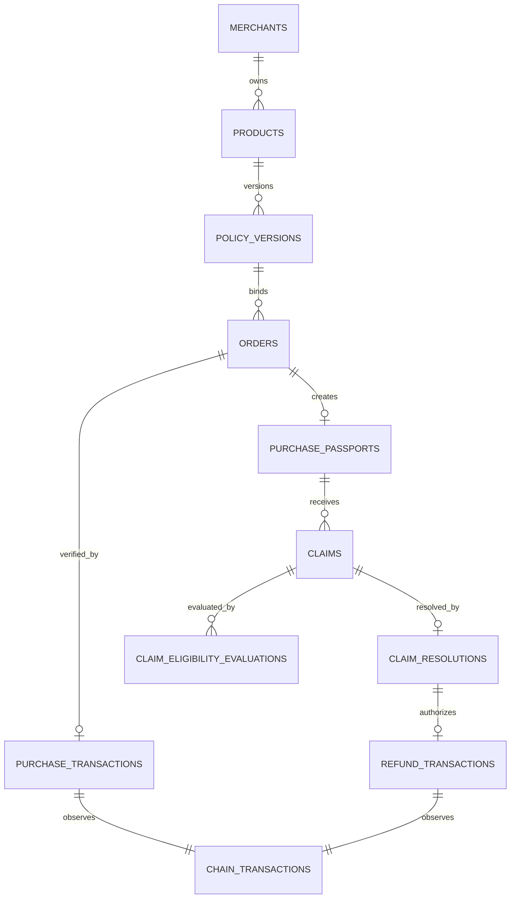

# Data model

## Conventions

PostgreSQL is authoritative for workflow but not for blockchain facts. Tables use internal `uuid` primary keys and expose server-generated 22-character base64url `public_id` values. Addresses are stored in canonical no-space uppercase form; transaction hashes and hex proofs are normalized lower-case. Time uses `timestamptz` for operations and integer epoch milliseconds inside signed JSON. Money uses `bigint` in PostgreSQL and safe integer Luna in TypeScript; API schemas reject values above `Number.MAX_SAFE_INTEGER` and product-level limits.

Mutable operational rows carry `created_at`, `updated_at`, and optionally `version` for optimistic concurrency. Signed/chain evidence uses insert-only rows and append-only events. JSON fields have versioned schemas and are not unstructured dumping grounds.

Source classifications:

- **CHAIN:** independently observed Nimiq evidence.
- **SIGNATURE:** exact wallet-signed evidence verified against address.
- **USER:** bounded unsigned content; never authoritative for identity/payment.
- **BACKEND:** IDs, state, challenge time, eligibility result, cache.
- **DERIVED:** reproducible from other stored evidence.

## merchants

- `id uuid primary key` — BACKEND, immutable.
- `public_id char(22) unique not null` — BACKEND, immutable.
- `wallet_address varchar(36) unique not null` — SIGNATURE-bound after first verified policy; immutable in MVP.
- `display_name varchar(80) not null` — USER, mutable, NFC/control-character validated.
- `status merchant_status not null` (`active`, `disabled`) — BACKEND, mutable operational control.
- `created_at timestamptz not null`, `updated_at timestamptz not null` — BACKEND.

Indexes: unique address/public ID; status/created for operations. A display name is not verified legal identity; UI must say wallet identity unless a future verification system exists.

## products

- `id uuid primary key`, `public_id char(22) unique` — BACKEND, immutable.
- `merchant_id uuid references merchants` — BACKEND, immutable ownership.
- `name varchar(100) not null` — USER, mutable for future offerings; passports use signed snapshot.
- `description varchar(500) not null default ''` — USER, mutable and not signed in NR1.
- `status product_status` (`draft`, `active`, `archived`) — BACKEND, mutable.
- `active_policy_version_id uuid null references policy_versions` — DERIVED/controlled pointer, mutable only to a verified policy belonging to this product.
- timestamps/version — BACKEND.

Indexes: `(merchant_id, status)`, unique `(merchant_id, normalized_name)` only if UX later requires. Archiving never deletes history.

## policy_versions

- `id uuid primary key`, `public_id char(22) unique` — BACKEND, immutable.
- `product_id uuid references products`, `merchant_id uuid references merchants` — BACKEND, immutable.
- `version integer not null check (version > 0)` — BACKEND, immutable; unique `(product_id, version)`.
- `product_name varchar(100)`, `price_luna bigint check (> 0)` — SIGNATURE, immutable snapshot.
- `return_window_seconds bigint check (>= 0)`, `warranty_window_seconds bigint check (>= 0)`, `warranty_transfer_allowed boolean` — SIGNATURE, immutable.
- `protocol_version varchar(8)`, `challenge_nonce char(22) unique`, `payload jsonb`, `canonical_message text`, `payload_hash char(64)` — SIGNATURE/BACKEND, immutable.
- `merchant_address varchar(36)`, `public_key char(64)`, `signature char(128)` — SIGNATURE, immutable after verification.
- `verification_status` (`pending`, `verified`, `invalid`, `expired`), `verified_at timestamptz`, `verifier_version varchar(40)` — BACKEND result; one-way transitions.
- `created_at timestamptz` — BACKEND.

Indexes: `(product_id, version desc)`, `(merchant_id, verification_status)`, unique payload hash where verified if policy reuse is disallowed. Database privileges/trigger reject update/delete after `verified`.

## orders

- `id uuid primary key`, `public_id char(22) unique` — BACKEND, immutable token used in purchase tag.
- `product_id`, `policy_version_id`, `merchant_id` foreign keys — BACKEND, immutable bindings.
- `buyer_address varchar(36) null` — unset at order creation; populated immutably from the macro-final verified CHAIN sender in the purchase transaction.
- `network varchar(24) not null`, `expected_recipient varchar(36)`, `expected_value_luna bigint`, `expected_data varchar(64)` — BACKEND copied from verified policy; immutable.
- `payment_state` (`payment_requested`, `payment_cancelled`, `payment_pending`, `payment_verifying`, `purchased`, `payment_failed`) — BACKEND, constrained transition.
- `failure_code varchar(50) null`, `expires_at timestamptz`, timestamps/version — BACKEND, mutable.

Indexes: partial `(buyer_address, created_at desc) where buyer_address is not null`, `(merchant_id, payment_state, created_at)`, `(payment_state, updated_at)` for retries. A constraint/transaction guard permits setting `buyer_address` only during the `purchased` transition and requires it thereafter. Expected data must equal protocol encoder output via application/check constraint where practical.

## chain_transactions (shared replay registry)

- `id uuid primary key` — BACKEND.
- `network varchar(24) not null`, `transaction_hash char(64) not null` — CHAIN key; unique `(network, transaction_hash)` across all uses.
- `purpose` (`purchase`, `refund`) and `resource_id uuid` — BACKEND immutable binding.
- `observed_state` (`absent`, `mempool`, `included`, `confirmed`, `invalid`, `inconclusive`) — CHAIN/BACKEND, monotonic except reorg handling.
- `raw_evidence jsonb null`, `provider_id varchar(80)`, `observed_at`, `block_number`, `block_hash`, `confirmations` — CHAIN/cache.
- `network_id`, `sender`, `recipient`, `value_luna`, `data_hex`, `data_text` — CHAIN normalized fields.
- `verification_checks jsonb`, `verifier_version`, timestamps — BACKEND result.

Indexes: retry `(observed_state, updated_at)` and resource `(purpose, resource_id)`. Raw response has a bounded schema/size and is not blindly returned publicly.

## purchase_transactions

- `id uuid primary key`, `order_id uuid unique references orders` — immutable one-to-one.
- `chain_transaction_id uuid unique references chain_transactions` — CHAIN link.
- `verified_at timestamptz`, `confirmation_policy varchar(40)` — BACKEND.

No mutable user fields. Insert only after all checks pass in the same transaction that marks order purchased.

## purchase_passports

- `id uuid primary key`, `public_id char(22) unique` — BACKEND.
- `order_id uuid unique`, `purchase_transaction_id uuid unique`, `policy_version_id uuid`, `product_id`, `merchant_id` — immutable relations.
- `original_buyer_address varchar(36)` — DERIVED from verified purchase sender, immutable.
- `purchase_time timestamptz`, `return_deadline timestamptz null`, `warranty_deadline timestamptz null` — DERIVED from CHAIN + SIGNATURE, immutable.
- `status passport_status` (`active`, `refunded`) — DERIVED workflow; mutable only through verified refund.
- `created_at`, `updated_at` — BACKEND.

Indexes: buyer chronology, merchant chronology, active deadlines. Product/policy names and terms are read through immutable policy version; an optional denormalized snapshot must be verified for equality.

## claims

- `id uuid primary key`, `public_id char(22) unique` — BACKEND; public ID used in refund tag.
- `passport_id`, `order_id`, `policy_version_id` foreign keys — BACKEND immutable.
- `buyer_address`, `claim_type`, `reason_code`, `note`, `claim_time` — SIGNATURE immutable.
- `challenge_nonce char(22) unique`, `payload jsonb`, `canonical_message`, `payload_hash`, `public_key`, `signature`, `verifier_version` — SIGNATURE immutable.
- `signature_status` (`pending`, `verified`, `invalid`, `expired`) — BACKEND one-way.
- `workflow_state` (`submitted`, `eligible`, `ineligible`, `decision_pending`, `approved`, `rejected`, `refund_pending`, `refunded`, `refund_verification_failed`) — BACKEND/DERIVED constrained.
- timestamps — BACKEND.

Indexes: merchant queue via join or denormalized immutable `merchant_id`, buyer/passport history, workflow/retry. Exact active-claim uniqueness rule is finalized in Phase 3; database must prevent accidental duplicate same type/passport while an existing claim is unresolved.

## claim_eligibility_evaluations

- `id uuid primary key`, `claim_id uuid references claims` — BACKEND.
- `evaluator_version varchar(40)`, `evaluated_at timestamptz` — BACKEND.
- `inputs jsonb`, `rule_results jsonb`, `eligible boolean` — DERIVED, immutable.
- `supersedes_id uuid null references same table`, `reason varchar(100) null` — BACKEND correction audit.

Unique partial index allows one current evaluation per claim. Inputs include verified purchase time, signed duration, claim time, signer/order validity flags—not physical assertions.

## claim_resolutions

- `id uuid primary key`, `public_id char(22) unique`, `claim_id uuid unique` — BACKEND/one final MVP decision.
- `merchant_address`, `decision`, `reason_code`, `note`, `approved_refund_luna`, `resolution_time` — SIGNATURE immutable.
- `challenge_nonce`, `payload`, `canonical_message`, `payload_hash`, `public_key`, `signature`, `verifier_version` — SIGNATURE immutable and nonce unique.
- `verification_status`, `verified_at`, `created_at` — BACKEND one-way.

Constraints enforce rejected amount `0`, approved amount equals order price at domain layer plus transaction/trigger, and signer equals policy merchant.

## refund_transactions

- `id uuid primary key`, `claim_id uuid unique`, `resolution_id uuid unique` — immutable one completion per claim.
- `chain_transaction_id uuid unique references chain_transactions` — CHAIN link.
- `verified_at`, `confirmation_policy` — BACKEND.

Inserted only after all refund checks pass, atomically moving claim/passport state. Cancelled or failed attempts are protocol events and optionally a separate bounded `refund_attempts` operational table; they are not refund transactions.

## protocol_events

- `id bigint generated always as identity primary key` — BACKEND.
- `event_id uuid unique`, `aggregate_type`, `aggregate_id`, `event_type`, `protocol_version` — BACKEND.
- `occurred_at timestamptz`, `actor_address varchar(36) null`, `causation_id uuid null`, `correlation_id uuid` — BACKEND/attribution.
- `evidence_type` (`signature`, `chain`, `backend`), `evidence_id uuid null`, `payload jsonb` — derived reference and bounded event facts.
- `created_at timestamptz default now()` — BACKEND.

Append-only; API role cannot update/delete. Index `(aggregate_type, aggregate_id, id)`, `(event_type, occurred_at)`, and evidence reference. Events support lifecycle rendering/audit but do not replace normalized current-state constraints.

## idempotency_keys and signing_challenges

Supporting tables are required although they are not product entities.

`idempotency_keys`: wallet/action/key unique, request hash, response status/body reference, created/expiry. A key reused with a different request hash returns conflict.

`signing_challenges`: nonce unique, action, resource, expected address, canonical message/hash, expires/consumed timestamps. Consumption and evidence insert occur in one transaction.

## Relationships

## Promise Ledger derivation

No ledger table accepts manual counts. A view groups by merchant:

- verified purchases: count purchase transactions;
- eligible/ineligible claims: current eligibility rows joined to verified claims;
- approved/rejected/unresolved: verified resolutions and claims without resolution;
- refunds paid: verified refund transactions; approved pending: approved minus paid;
- warranty resolutions: verified resolution count for WARRANTY claims, split by decision/payment as UI needs;
- median resolution time: `percentile_cont(0.5)` of verified resolution time minus accepted claim time.

Definitions and `as_of` time accompany every public response. Reconciliation compares view counts to append-only events and reports—not patches—differences.

## Retention, deletion, and privacy

Signed policies and commerce evidence must remain available to verify a passport. Public display is minimized and role-scoped, but on-chain addresses cannot be promised deletion from the blockchain. Drafts, expired challenges, idempotency records, raw RPC responses, and operational logs receive explicit short retention schedules before launch. Notes may contain user-entered personal data, so UI warns against sensitive details and retention/export/deletion behavior requires legal/privacy review. Hard deletion must never orphan or falsify immutable evidence; tombstoning nonessential display data is preferred where legally required.
