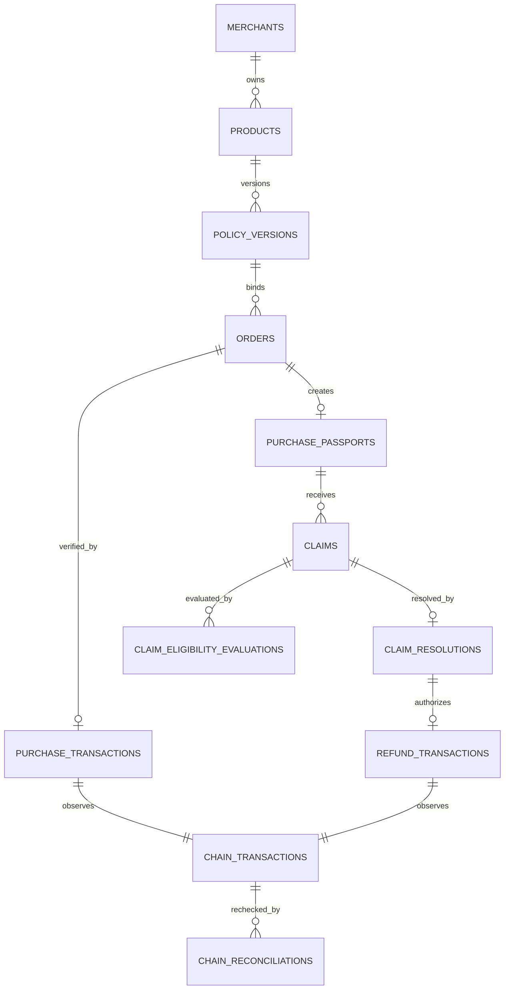

# Data model

## Conventions

PostgreSQL is authoritative for workflow but not for blockchain facts. Tables use internal `uuid` primary keys and expose server-generated 22-character base64url `public_id` values. Addresses are stored in canonical no-space uppercase form; transaction hashes and hex proofs are normalized lower-case. Time uses `timestamptz` for operations and integer epoch milliseconds inside signed JSON. Money uses `bigint` in PostgreSQL and safe integer Luna in TypeScript; API schemas reject values above `Number.MAX_SAFE_INTEGER` and product-level limits.

Mutable operational rows carry `created_at`, `updated_at`, and optionally `version` for optimistic concurrency. Signed/chain evidence uses insert-only rows and append-only events. JSON fields have versioned schemas and are not unstructured dumping grounds.

Source classifications:

- **CHAIN:** independently observed Nimiq evidence.
- **SIGNATURE:** exact wallet-signed evidence verified against address.
- **USER:** bounded unsigned content; never authoritative for identity/payment.
- **BACKEND:** IDs, state, challenge time, eligibility result, cache.
- **DERIVED:** reproducible from other stored evidence.

## merchants

- `id uuid primary key` — BACKEND, immutable.
- `public_id char(22) unique not null` — BACKEND, immutable.
- `policy_signer_address varchar(36) null` — DERIVED from the first verified policy proof public key; unique when present and immutable in MVP.
- `default_settlement_address varchar(36) not null` — USER-selected canonical address used only as the default for a new policy challenge; mutable and never signer authority.
- `display_name varchar(80) not null` — USER, mutable, NFC/control-character validated.
- `status merchant_status not null` (`active`, `disabled`) — BACKEND, mutable operational control.
- `created_at timestamptz not null`, `updated_at timestamptz not null` — BACKEND.

Indexes: unique partial policy signer/public ID; status/created for operations. The first valid policy proof under an expiring server-held bootstrap challenge atomically sets `policy_signer_address`; a concurrent different signer loses the compare-and-set. A display name is not verified legal identity, and a settlement address is not signing authority.

## products

- `id uuid primary key`, `public_id char(22) unique` — BACKEND, immutable.
- `merchant_id uuid references merchants` — BACKEND, immutable ownership.
- `name varchar(100) not null` — USER, mutable for future offerings; passports use signed snapshot.
- `description varchar(500) not null default ''` — USER, mutable and not signed in NR1.
- `status product_status` (`draft`, `active`, `archived`) — BACKEND, mutable.
- `active_policy_version_id uuid null references policy_versions` — DERIVED/controlled pointer, mutable only to a verified policy belonging to this product.
- timestamps/version — BACKEND.

Indexes: `(merchant_id, status)`, unique `(merchant_id, normalized_name)` only if UX later requires. Archiving never deletes history.

## policy_versions

- `id uuid primary key`, `public_id char(22) unique` — BACKEND, immutable.
- `product_id uuid references products`, `merchant_id uuid references merchants` — BACKEND, immutable.
- `version integer not null check (version > 0)` — BACKEND, immutable; unique `(product_id, version)`.
- `product_name varchar(100)`, `price_luna bigint check (> 0)` — SIGNATURE, immutable snapshot.
- `return_window_seconds bigint check (>= 0)`, `warranty_window_seconds bigint check (>= 0)`, `warranty_transfer_allowed boolean` — SIGNATURE, immutable.
- `protocol_version varchar(8)`, `challenge_nonce char(22) unique`, `payload jsonb`, `canonical_message text`, `payload_hash char(64)` — SIGNATURE/BACKEND, immutable.
- `settlement_address varchar(36)` — SIGNATURE from the canonical policy payload; immutable and authoritative for purchase recipient and NR1 refund-source expectations tied to this version.
- `signer_address varchar(36)`, `public_key char(64)`, `signature char(128)` — signer address DERIVED from the proof public key; proof immutable after verification. `signer_address` must equal the merchant's established `policy_signer_address`, except that the first valid proof establishes it atomically.
- `verification_status` (`pending`, `verified`, `invalid`, `expired`), `verified_at timestamptz`, `verifier_version varchar(40)` — BACKEND result; one-way transitions.
- `created_at timestamptz` — BACKEND.

Indexes: `(product_id, version desc)`, `(merchant_id, verification_status)`, unique payload hash where verified if policy reuse is disallowed. Database privileges/trigger reject update/delete after `verified`.

## orders

- `id uuid primary key`, `public_id char(22) unique` — BACKEND, immutable token used in purchase tag.
- `product_id`, `policy_version_id`, `merchant_id` foreign keys — BACKEND, immutable bindings.
- `product_name`, `product_description`, `merchant_display_name` — BACKEND snapshots copied before the wallet request; immutable display context.
- `policy_payload_hash`, `policy_version`, `protocol_version` — SIGNATURE/BACKEND snapshot of the exact verified active policy; immutable.
- `buyer_address varchar(36) null` — unset at order creation; populated immutably from the macro-final verified CHAIN sender in the purchase transaction.
- `network varchar(24) not null`, `expected_recipient varchar(36)`, `expected_value_luna bigint`, `expected_data varchar(64)` — BACKEND copied from the verified policy settlement address/price and generated order tag; immutable.
- `payment_state` (`payment_requested`, `wallet_request_started`, `payment_cancelled`, `submission_outcome_unknown`, `payment_verifying`, `payment_pending`, `payment_failed`, `expired`, `purchased`) — BACKEND, constrained transition. Cancellation can retry before a hash; ambiguous submission cannot reopen the wallet request.
- `failure_code varchar(50) null`, `expires_at timestamptz`, timestamps/version — BACKEND, mutable.

Indexes: partial `(buyer_address, created_at desc) where buyer_address is not null`, `(merchant_id, payment_state, created_at)`, `(payment_state, updated_at)` for retries. A constraint/transaction guard permits setting `buyer_address` only during the `purchased` transition and requires it thereafter. Expected data must equal protocol encoder output via application/check constraint where practical.

## chain_transactions (shared replay registry)

- `id uuid primary key` — BACKEND.
- `network varchar(24) not null`, `transaction_hash char(64) not null` — CHAIN key; unique `(network, transaction_hash)` across all uses.
- `purpose` (`purchase`, `refund`) and `resource_id uuid` — BACKEND immutable binding.
- `observed_state` (`absent`, `mempool`, `included`, `finalized`, `invalid`, `inconclusive`) — CHAIN/BACKEND; finalized/invalid evidence is terminal and immutable. Reorg correction is appended separately.
- `normalized_evidence jsonb null`, `provider_id varchar(80)`, `observed_at`, `block_number`, `block_timestamp_ms`, `finalizing_block_number`, `head_block_number`, `confirmations` — CHAIN/cache.
- `execution_result`, `sender`, `recipient`, `value_luna`, `data_text` — CHAIN normalized fields.
- `verification_checks jsonb`, `verification_reason`, `verifier_version`, timestamps — BACKEND result.

Indexes: retry `(observed_state, updated_at)` and resource `(purpose, resource_id)`. Raw response has a bounded schema/size and is not blindly returned publicly.

## chain_reconciliations

- `id uuid primary key`, `chain_transaction_id uuid references chain_transactions` — BACKEND immutable link.
- `outcome` (`confirmed`, `inconclusive`, `exception`) — DERIVED from a fresh independent RPC read.
- `normalized_evidence jsonb null`, `reason`, `verifier_version`, `checked_at` — CHAIN/BACKEND append-only recheck record.

Rows cannot update/delete under either trigger or runtime role. The latest result is a derived public status: an exception makes the Passport `verification_exception`; a later independent confirmation may restore the derived active display without erasing the exception history. RPC outage/not-found is inconclusive, not an invented reorg or permanent invalidation.

## purchase_transactions

- `id uuid primary key`, `order_id uuid unique references orders` — immutable one-to-one.
- `chain_transaction_id uuid unique references chain_transactions` — CHAIN link.
- `verified_at timestamptz`, `confirmation_policy varchar(40)` — BACKEND.

No mutable user fields. Insert only after all checks pass in the same transaction that marks order purchased.

## purchase_passports

- `id uuid primary key`, `public_id char(22) unique` — BACKEND.
- `order_id uuid unique`, `purchase_transaction_id uuid unique`, `policy_version_id uuid`, `product_id`, `merchant_id` — immutable relations.
- `original_buyer_address varchar(36)` — DERIVED from verified purchase sender, immutable.
- `product_name`, `product_description`, `merchant_display_name`, `policy_payload_hash`, `policy_version`, `protocol_version`, `price_luna`, `settlement_recipient` — immutable order/policy snapshot copied under database validation.
- `purchase_time timestamptz`, `return_deadline timestamptz null`, `warranty_deadline timestamptz null` — DERIVED from CHAIN + SIGNATURE, immutable.
- `status passport_status` (`active`, `refunded`) — DERIVED workflow; mutable only through verified refund.
- `created_at`, `updated_at` — BACKEND.

Indexes: buyer chronology, merchant chronology, active deadlines. Product/policy names and terms are read through immutable policy version; an optional denormalized snapshot must be verified for equality.

## claims

- `id uuid primary key`, `public_id char(22) unique` — BACKEND; public ID used in refund tag.
- `passport_id`, `order_id`, `policy_version_id` foreign keys — BACKEND immutable.
- `purchase_sender_address` — CHAIN/DERIVED from the purchase passport and included in the candidate signed payload; it is not inferred from the claim proof.
- `claim_signer_address` — DERIVED from the claim proof public key; never copied from a wallet account selection.
- `claim_type`, `reason_code`, `note`, `claim_time` — SIGNATURE immutable.
- `challenge_nonce char(22) unique`, `payload jsonb`, `canonical_message`, `payload_hash`, `public_key`, `signature`, `verifier_version` — SIGNATURE immutable.
- `signature_status` (`pending`, `verified`, `invalid`, `expired`) — BACKEND one-way.
- `workflow_state` (`authorization_pending`, `eligible`, `ineligible`, `decision_pending`, `approved`, `rejected`, `refund_pending`, `refunded`, `refund_verification_failed`) — BACKEND/DERIVED constrained. A valid claim proof is not accepted as filed while authorization is pending.
- timestamps — BACKEND.

Indexes: merchant queue via join or denormalized immutable `merchant_id`, purchase-sender/passport history, workflow/retry. One accepted unresolved claim per Passport/type is enforced by a partial unique index. D-025 allows observed claim-signer/purchase-sender equality or a verified exact-claim authorization; no other relationship is authoritative.

## claim_authorizations

- `id uuid primary key`, `public_id char(22) unique`, `claim_id uuid references claims` — BACKEND immutable identity and exact claim binding.
- `authorization_mode` (`self`, `delegated`) — DERIVED. `self` records observed claim-signer/purchase-sender equality and carries no second proof. `delegated` requires the complete proof fields below.
- `purchase_sender_address`, `claim_signer_address`, `claim_payload_hash` — CHAIN/DERIVED/SIGNATURE immutable copies that must equal the referenced claim.
- `challenge_nonce char(22) unique`, `payload jsonb`, `canonical_message`, `payload_hash` — BACKEND/SIGNATURE immutable. Delegated challenges are domain-separated `CLAIM_AUTHORIZATION`; self rows use the claim nonce/hash as their audit binding and no fabricated second message.
- `public_key`, `signature`, `authorization_signer_address`, `verifier_version`, `verified_at` — SIGNATURE/DERIVED immutable and required only for delegated authorization. The derived authorization signer must equal `purchase_sender_address`.
- `expires_at`, `consumed_at`, `created_at` — BACKEND. Delegated challenge consumption and claim acceptance/evaluation are atomic.

Unique constraints allow one successful authorization per claim and prevent nonce/public-ID reuse. Runtime triggers make completed authorization evidence append-only.

## claim_eligibility_evaluations

- `id uuid primary key`, `claim_id uuid references claims` — BACKEND.
- `evaluator_version varchar(40)`, `evaluated_at timestamptz` — BACKEND.
- `inputs jsonb`, `rule_results jsonb`, `eligible boolean` — DERIVED, immutable.
- `supersedes_id uuid null references same table`, `reason varchar(100) null` — BACKEND correction audit.

Unique partial index allows one current evaluation per claim. Inputs include verified purchase time, signed duration, claim time, completed claimant-authorization result, and order validity flags—not physical assertions.

## claim_resolutions

- `id uuid primary key`, `public_id char(22) unique`, `claim_id uuid unique` — BACKEND/one final MVP decision.
- `policy_signer_address`, `decision`, `reason_code`, `note`, `approved_refund_luna`, `resolution_time` — SIGNATURE immutable; signer address is copied from the merchant identity and checked against the proof-derived signer.
- `challenge_nonce`, `payload`, `canonical_message`, `payload_hash`, `public_key`, `signature`, `verifier_version` — SIGNATURE immutable and nonce unique.
- `verification_status`, `verified_at`, `created_at` — BACKEND one-way.

Constraints enforce rejected amount `0`, approved amount equals order price at domain layer plus transaction/trigger, and signer equals the policy signer. Refund transaction verification separately requires its sender to equal the purchase-bound policy settlement address; no signer/settlement equality is required.

## refund_attempts

- `id uuid primary key`, `public_id char(22) unique`, `claim_id`, `resolution_id`, `passport_id`, `merchant_id` — BACKEND immutable resource binding.
- `network`, `expected_sender`, `expected_recipient`, `expected_value_luna`, `expected_data` — DERIVED immutable from the purchase-bound verified evidence; never accepted from the client.
- `wallet_state` (`payment_requested`, `wallet_request_started`, `payment_cancelled`, `submission_outcome_unknown`, `payment_verifying`, `payment_pending`, `payment_failed`, `refunded`) — BACKEND constrained.
- `transaction_hash char(64) null`, `failure_code`, `row_version`, timestamps — CHAIN/BACKEND. One attempt accepts at most one normalized hash.

A partial unique index permits one open attempt per claim and blocks a second native prompt after a hashless ambiguous outcome. Cancelled or definitively failed attempts remain immutable history and permit a deliberate new attempt. Exact state retries are idempotent; transition constraints and row locks prevent regressions.

## refund_transactions

- `id uuid primary key`, `claim_id uuid unique`, `resolution_id uuid unique` — immutable one completion per claim.
- `chain_transaction_id uuid unique references chain_transactions` — CHAIN link.
- `verified_at`, `confirmation_policy` — BACKEND.

Inserted only after all refund checks pass, atomically moving claim/passport state. It also references the exact `refund_attempt_id`, which is unique. Cancelled, ambiguous, pending, inconclusive, or failed attempts are not refund transactions.

## protocol_events

- `id bigint generated always as identity primary key` — BACKEND.
- `event_id uuid unique`, `aggregate_type`, `aggregate_id`, `event_type`, `protocol_version` — BACKEND.
- `occurred_at timestamptz`, `actor_address varchar(36) null`, `causation_id uuid null`, `correlation_id uuid` — BACKEND/attribution.
- `evidence_type` (`signature`, `chain`, `backend`), `evidence_id uuid null`, `payload jsonb` — derived reference and bounded event facts.
- `created_at timestamptz default now()` — BACKEND.

Append-only; API role cannot update/delete. Index `(aggregate_type, aggregate_id, id)`, `(event_type, occurred_at)`, and evidence reference. Events support lifecycle rendering/audit but do not replace normalized current-state constraints.

## idempotency_keys and signing_challenges

Supporting tables are required although they are not product entities.

`idempotency_keys`: wallet/action/key unique, request hash, response status/body reference, created/expiry. A key reused with a different request hash returns conflict.

`signing_challenges`: policy-specific challenge rows retain their existing shape. Claim and resolution challenges use their evidence tables because claim authorization may require a second proof and each resource has stricter relational constraints. A policy expected signer is null only for a new merchant's first bootstrap; claim authorization always copies its expected purchase sender from verified chain evidence.

`merchant_bootstrap_sessions`: hash of a 128-bit-or-stronger opaque capability, merchant ID, expiry, consumed timestamp, and creation metadata. The raw capability exists only in a short-lived `HttpOnly`, `Secure`, `SameSite` session. It authorizes first-policy challenge creation/submission but is not wallet identity; consumption, proof verification, and signer establishment are atomic. Established signer rows have no reset through this table.

The established-merchant HTTP session is intentionally stateless and is not a database authority row. Its server-HMAC-authenticated cookie contains only a merchant public ID, fixed format version, and eight-hour expiry. It is `HttpOnly`, `Secure` in production, and `SameSite=Strict`; successful policy publication rotates it. It authorizes a later challenge request for the same merchant but never satisfies policy publication, which still derives and matches the established Nimiq signer. `SESSION_SECRET` is server-only and required in production.

## Relationships

## Promise Ledger derivation

No ledger table accepts manual counts. A view groups by merchant:

- verified purchases: count purchase transactions;
- eligible/ineligible claims: current eligibility rows joined to verified claims;
- approved/rejected/unresolved: verified resolutions and claims without resolution;
- refunds paid: verified refund transactions; approved pending: approved minus paid;
- warranty resolutions: verified resolution count for WARRANTY claims, split by decision/payment as UI needs;
- median resolution time: `percentile_cont(0.5)` of verified resolution time minus accepted claim time.

Definitions and `as_of` time accompany every public response. Reconciliation compares view counts to append-only events and reports—not patches—differences.

## Retention, deletion, and privacy

Signed policies and commerce evidence must remain available to verify a passport. Public display is minimized and role-scoped, but on-chain addresses cannot be promised deletion from the blockchain. Drafts, expired challenges, idempotency records, raw RPC responses, and operational logs receive explicit short retention schedules before launch. Notes may contain user-entered personal data, so UI warns against sensitive details and retention/export/deletion behavior requires legal/privacy review. Hard deletion must never orphan or falsify immutable evidence; tombstoning nonessential display data is preferred where legally required.
